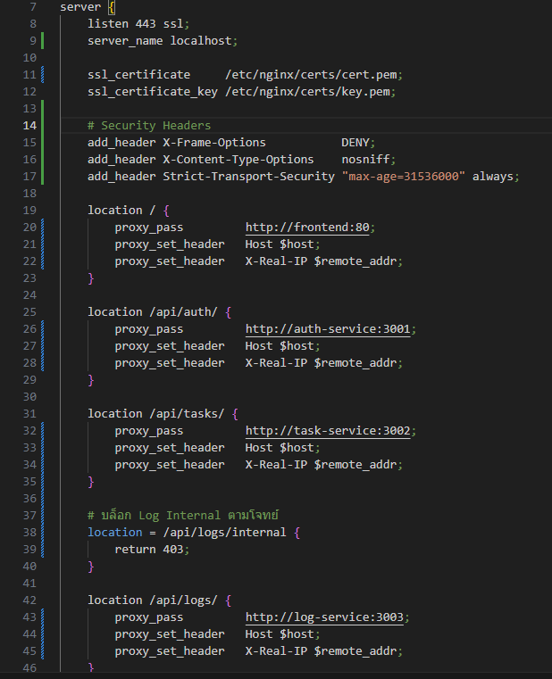
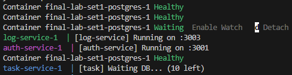
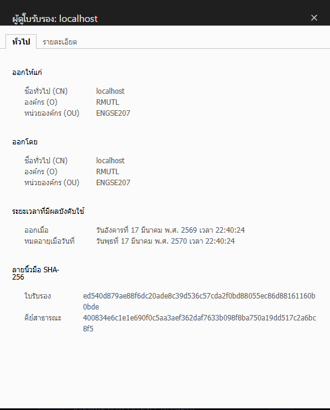
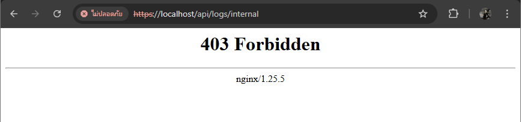
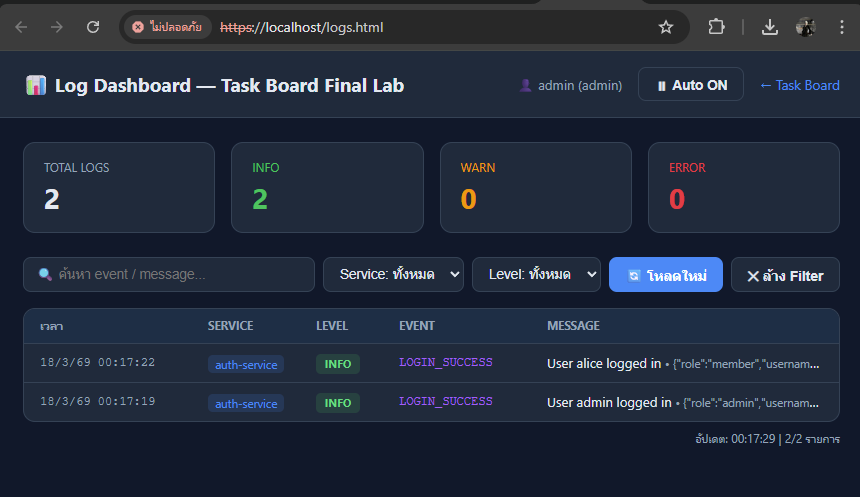
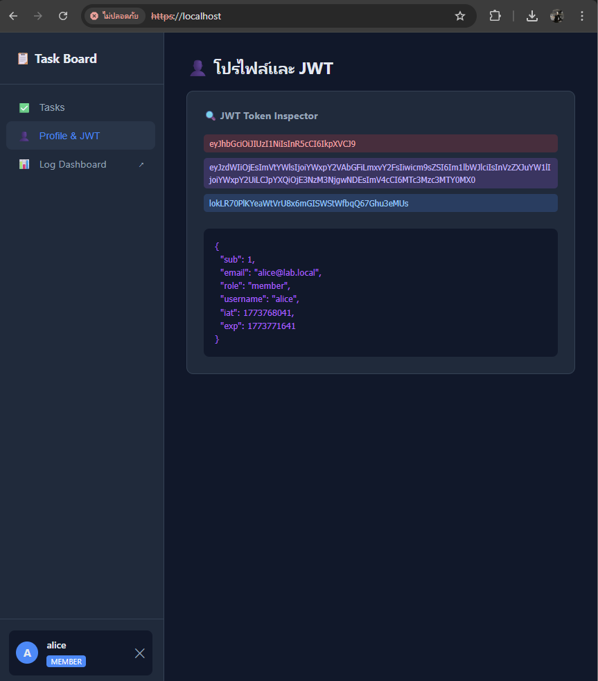

# 📝 INDIVIDUAL_REPORT (รายงานสรุปผลงานรายบุคคล)

**ชื่อ-นามสกุล:** [ภาณุวัฒน์ ยาท้วม] 
**รหัสนักศึกษา:** [ใส่รหัสนักศึกษาของคุณบาส]
**บทบาทในโปรเจกต์:** Infrastructure & System Security Engineer

---

## 🛠️ ส่วนที่ 1: การจัดการระบบโครงสร้างพื้นฐาน (Infrastructure)

ผมรับผิดชอบการออกแบบและติดตั้งระบบ API Gateway เพื่อเป็นทางเข้าหลักของระบบ Microservices ทั้งหมด

### 1.1 การตั้งค่า Nginx API Gateway และ Routing
ดำเนินการเขียนไฟล์ `nginx.conf` เพื่อทำ Reverse Proxy ส่งข้อมูลไปยัง Service ต่างๆ

### 1.2 การ Deployment ด้วย Docker Compose
จัดการควบคุมการรัน Container ทั้งหมดให้ทำงานร่วมกันอย่างเป็นระบบ

---

## 🔐 ส่วนที่ 2: ระบบความปลอดภัย (Security Configuration)

เน้นการป้องกันข้อมูลและการสื่อสารที่ปลอดภัยตามสถาปัตยกรรมที่ได้รับมอบหมาย

### 2.1 การติดตั้ง HTTPS และ SSL Certificate
สร้าง Self-signed Certificate (RMUTL) และตั้งค่าการเข้ารหัสข้อมูลผ่าน Port 443

### 2.2 การป้องกัน Internal API (Access Control)
ตั้งค่า Nginx เพื่อบล็อกการเข้าถึงเส้นทาง `/api/logs/internal` จากบุคคลภายนอก

---

## 📊 ส่วนที่ 3: การตรวจสอบและทดสอบระบบ (System Testing)

### 3.1 ระบบ Log Dashboard (Admin Only)
ตรวจสอบการบันทึกเหตุการณ์ (Events) และสถิติการใช้งานผ่านหน้า Dashboard

### 3.2 JWT Token Inspector
ทดสอบความถูกต้องของการออกบัตรผ่าน (Token) และการตรวจสอบสถานะ Login

---

## 🚧 ปัญหาที่พบและวิธีการแก้ไข
- **ปัญหา:** หน้าหลักไม่แสดงผล CSS (Mixed Content) เมื่อรันผ่าน HTTPS
- **การแก้ไข:** ดำเนินการ Hard Refresh และรวมไฟล์ให้เป็น Single File เพื่อให้ Nginx ส่งข้อมูลได้สมบูรณ์