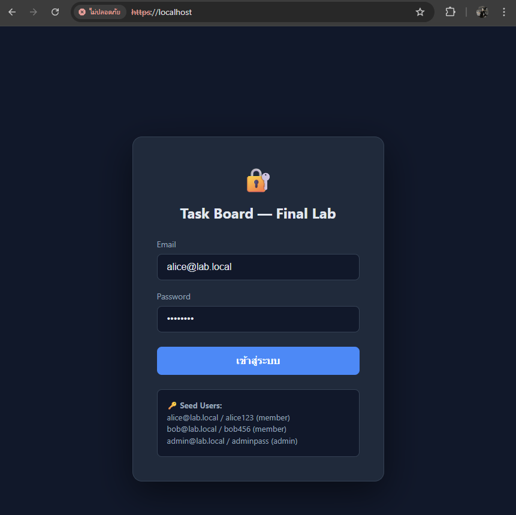

# 📋 Task Board Management System (Microservices Set 1)

โปรเจกต์นี้เป็นส่วนหนึ่งของวิชา **ENGSE207 Software Architecture** พัฒนาขึ้นเพื่อสาธิตการทำงานของระบบ Microservices ที่มีความมั่นคงปลอดภัยสูง โดยใช้การสื่อสารผ่านโปรโตคอล HTTPS และจัดการเส้นทางข้อมูลด้วย Nginx API Gateway

---

## 🏗️ สถาปัตยกรรมของระบบ (System Architecture)

ระบบประกอบด้วย Services หลักที่ทำงานแยกออกจากกันบน Docker Containers:
- **Frontend**: หน้าเว็บ SPA (Single Page Application) พัฒนาด้วย HTML/JS
- **Nginx Gateway**: ทำหน้าที่เป็น API Gateway รองรับ HTTPS (Port 443) และทำ Reverse Proxy
- **Auth Service**: จัดการระบบสมาชิกและการออกบัตรผ่าน JWT Token
- **Task Service**: จัดการข้อมูลรายการงาน (CRUD Operations)
- **Log Service**: บันทึกเหตุการณ์การใช้งานระบบเพื่อความโปร่งใส
- **Database**: ระบบจัดการฐานข้อมูลกลางโดยใช้ PostgreSQL

---

## 📸 หลักฐานการทำงาน (System Implementation)

### 1. การเริ่มต้นระบบ (System Startup)
รันระบบทั้งหมดผ่าน Docker Compose จนทุก Service อยู่ในสถานะ Healthy


### 2. ความมั่นคงปลอดภัย (HTTPS & SSL)
ระบบสื่อสารผ่าน SSL Certificate ที่สร้างขึ้นมาโดยเฉพาะ (Self-signed)


### 3. ส่วนติดต่อผู้ใช้งาน (User Interface)
หน้าจอ Login และ Dashboard ในรูปแบบ Dark Mode ที่เชื่อมต่อกับ API Gateway สมบูรณ์



---

## 🚀 วิธีการติดตั้งและรันโปรเจกต์ (Installation Guide)

1. **เตรียมไฟล์ Configuration**:
   - ตรวจสอบไฟล์ `.env` สำหรับกำหนดค่า Database และ JWT Secret
2. **สร้างระบบด้วย Docker**:
   ```bash
   docker compose up --build
3. **เข้าใช้งานระบบ**:

    เปิด Browser ไปที่: https://localhost

    ทดสอบ Login ด้วยบัญชี Seed Users (Alice/Bob/Admin)


## สมาชิกในกลุ่ม
1. [67543210036-9] [นายบวรรัตน์  ศิริเมือง] (Member 1)
2. [67543210043-5] [นายภาณุวัฒน์  ยาท้วม] (Member 2)